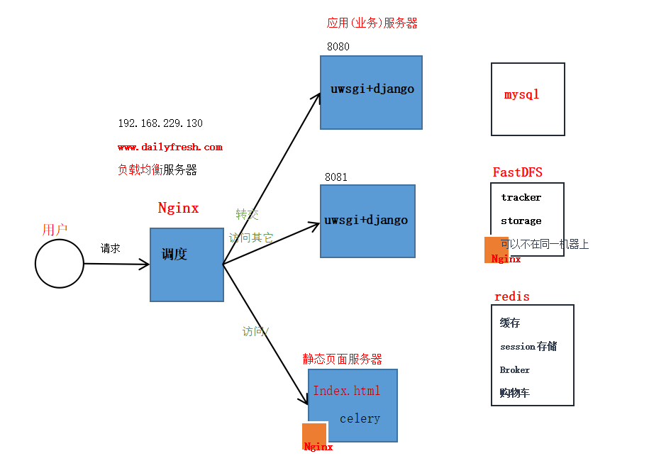
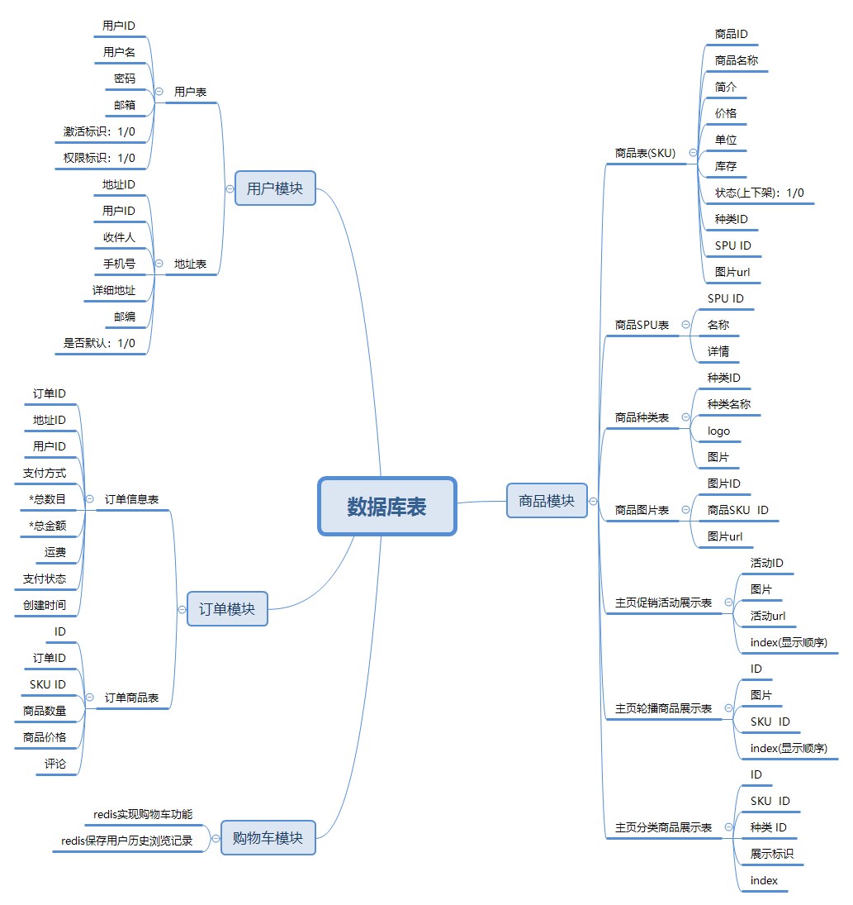

# dailyfresh-B2C  Distributed   
dailyfresh mall based on B2C model     
> B2C(Business-to-Customer)
> A business-to-person business model, referred to as "business-to-customer". Business-to-customer is a mode of e-commerce, which is generally based on e-tailing, mainly through the Internet to carry out online sales activities. B2C means that companies provide consumers with a new shopping environment through the Internet - an online store, and consumers shop and pay online through the Internet.

Provide a new shopping environment for consumers:   
Start from zero, build, develop, deploy, and build a daily fresh food mall

#### Technology Stack
- Language: Python3.* (Django)   
- Database: MySql, redis  
- Task queue (asynchronous processing): celery (django-celery)     
- distributed file systems: FastDFS   
- search engine (product search): haystack(django-haystack), whoosh, secondary development    
- web server configuration: Nginx+ uwsgi 
- Development Environment: PyCharm, Linux, vim 
 ##### 技术栈
- 语言：Python3.* (Django)   
- 数据库: MySql、 redis  
- 任务队列(异步处理): celery(django-celery)     
- 分布式文件存储: FastDFS   
- 搜索引擎(商品检索)：  haystack(django-haystack)、whoosh、二次开发    
- web服务器配置: Nginx+ uwsgi    
- 开发环境： PyCharm、Linux、vim     

#### Technical Architecture
* Development Architecture    
The BS architecture, i.e. Browser/Server (browser/server) architecture, is used to build a web-based web mall system, and its architecture logic:   

* Deployment Architecture     
Nginx+uwsgi     
Deployment architecture: 

##### 技术架构
* 开发架构    
采用BS结构, 即Browser/Server(浏览器/服务器)结构,构建一个web的网站商城系统, 其架构逻辑:   
* 部署架构     
Nginx+uwsgi     

#### main module  
There are four main modules:    
* User Module,  
* Product-related module, 
* Shopping cart-related module,
* Order-related module.    
[View detailed analysis of each module](Readme/Analysis.md)
#####  主体模块  
主要分为四个大模块:    
* 用户模块、    
* 商品相关模块、    
* 购物车相关模块、   
* 订单相关模块、    
[查看各模块详情分析](Readme/Analysis.md)

#### database table

* SPU is the smallest unit of commodity information aggregation, a collection of reusable and easily retrievable standardized information that describes the characteristics of a product. In layman's terms, a product with the same attribute values and characteristics can be called an SPU.     
For example, iphone4 is an SPU, N97 is also an SPU, this has nothing to do with the merchant, nor with the color, style or package.
* SKU is the unit of stock in and out measurement, which can be in pieces, boxes, trays, etc. It is most commonly used in apparel and footwear.   
For example, a SKU in textiles usually means: size, color, style.
#####  数据库表
* SPU是商品信息聚合的最小单位，是一组可复用、易检索的标准化信息的集合，该集合描述了一个产品的特性。通俗点讲，属性值、特性相同的商品就可以称为一个SPU。     
例如，iphone4就是一个SPU，N97也是一个SPU，这个与商家无关，与颜色、款式、套餐也无关。
* SKU即库存进出计量的单位， 可以是以件、盒、托盘等为单位，在服装、鞋类商品中使用最多最普遍。   
例如纺织品中一个SKU通常表示：规格、颜色、款式。        
    
#### Function module show      
[Click to view](Readme/show.md)    
#### 功能模块展示      
[点击查看--多图预警](Readme/show.md)
    

#### Functionality and performance optimization
1. When users register to send activation emails, it may take a long time to send emails, and the client will need to wait, which is not a good user experience.     
 > Improve: Put the time consuming task to asynchronous execution in background, here use celery task queue, where use redis as middleware. 2.  
2. redis stores user browsing history, using list data structure: History_user id: [skuid1,skuid2,skuid3] 3.
3. use redis to store user shopping cart product information, using hash data structure: cart_userid: {'sku_id1': num, 'sku_id2': num}    
4. use distributed file system, store product images and other information in FastDFS system, Nginx + FastDFS with, reduce the pressure on the server. 5.         
5. static pages: home page, product list page, product details page and other common user pages, the page static, to reduce the operation of the database. When the background data changes automatically regenerate static pages.  
6. page data caching, the data used in the page is stored in the cache, when the data is used again, first from the cache, if not, then to query the database to reduce the number of database queries.  
7. order concurrency

#### 功能与性能优化
1. 用户注册发激活邮件时，可能发送邮件所需的时间较长，客户端会需要等待，用户体验不好。     
 >  改进: 把耗时的任务放到后台异步执行，此处使用celery任务队列, 其中使用redis作中间件。  
2. redis存储用户历史浏览记录, 采用list数据结构: History_用户id: [skuid1,skuid2,skuid3]
3. 使用redis存储用户购物车商品信息，采用hash数据结构: cart_userid: {'sku_id1': num, 'sku_id2': num}    
4. 采用分布式文件系统， 把商品图片等信息存储在FastDFS系统中, Nginx+FastDFS配合, 减少服务器的压力。         
5. 页面静态化： 首页、商品列表页、商品详情页等用户共同的页面, 把页面静态化，以减少对数据库的操作。当后台数据更改时自动重新生成静态页。  
6. 页面数据缓存，把页面使用的数据存放在缓存中，当再次使用这些数据时，先从缓存中获取，如获取不到，再去查询数据库，减少数据库的查询次数。  
7. 订单并发

### Links      
* Libfastcommon: 安装FastDFS之前要先安装它的依赖库libfastcommon    
[https://github.com/happyfish100/libfastcommon/releases](https://github.com/happyfish100/libfastcommon/releases)   
* FastDFS   
[https://github.com/happyfish100/FastDFS](https://github.com/happyfish100/FastDFS)
* Nginx    
[https://nginx.org/download/](https://nginx.org/download/)    
* fastdfs-nginx-module   
[https://github.com/happyfish100/fastdfs-nginx-module/releases](https://github.com/happyfish100/fastdfs-nginx-module/releases)   
* 支付宝api    
[https://open.alipay.com/platform/home.htm](https://open.alipay.com/platform/home.htm)    
* celery   
[http://docs.jinkan.org/docs/celery/](http://docs.jinkan.org/docs/celery/)   

